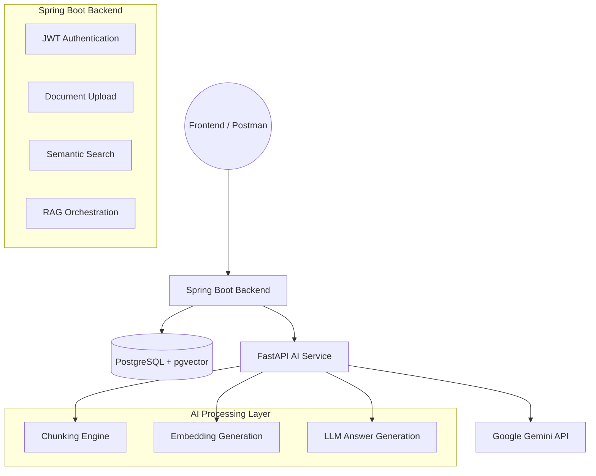
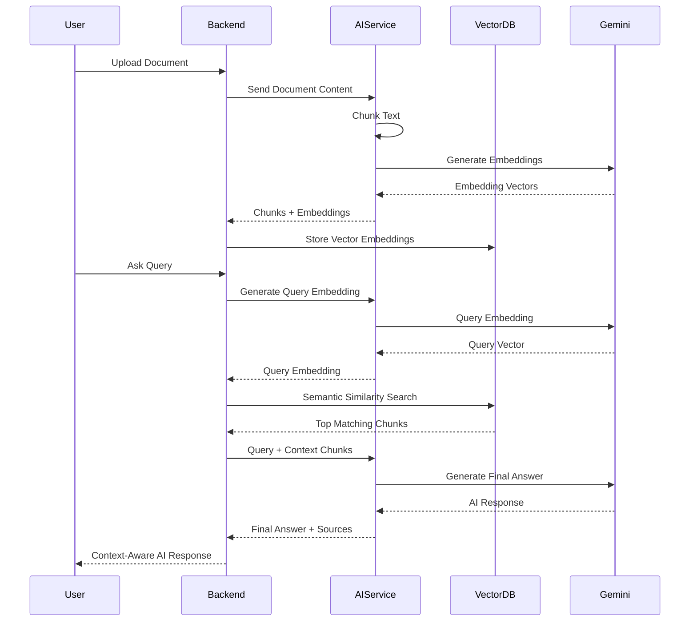
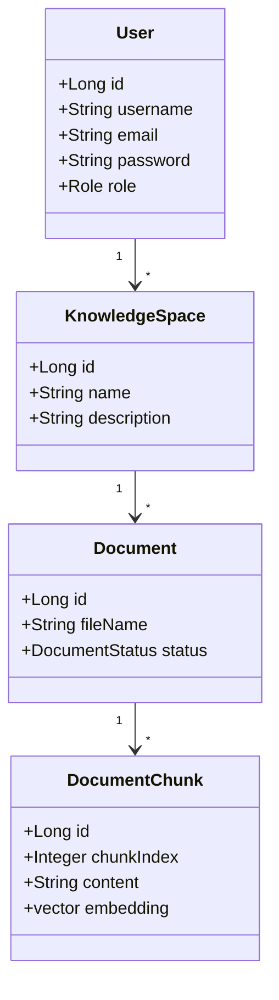
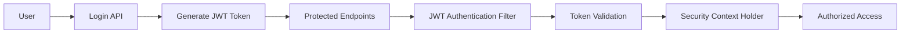

# Multi-Tenant AI Knowledge Hub 🧠📚


A production-style **Retrieval-Augmented Generation (RAG)** platform that enables users to create isolated knowledge spaces, upload documents, perform semantic search using vector embeddings, and generate AI-powered answers grounded strictly on uploaded content.

This project combines **Spring Boot**, **FastAPI**, **PostgreSQL + pgvector**, and **Google Gemini AI** to build a secure, scalable, multi-tenant AI knowledge assistant.

---

# 📌 1. Overview

The platform allows users to:

- Register and authenticate securely using JWT
- Create isolated knowledge spaces
- Upload documents into their personal workspace
- Automatically chunk and vectorize documents
- Store embeddings using PostgreSQL + pgvector
- Perform semantic similarity search
- Generate AI-powered context-aware answers using Gemini

Unlike traditional chatbots, this system provides:

✅ Grounded Responses  
✅ Semantic Retrieval  
✅ Multi-Tenant Isolation  
✅ Source Attribution  
✅ Context-Aware Generation  
✅ Enterprise-Style Architecture  

---

# 🛠️ 2. Tech Stack

| Category | Technology |
|---|---|
| Backend API | Spring Boot 3 (Java 17) |
| AI Service | FastAPI (Python) |
| Database | PostgreSQL 16 |
| Vector Database | pgvector |
| ORM | Spring Data JPA / Hibernate |
| Authentication | JWT + Spring Security |
| LLM | Google Gemini |
| Embedding Model | Gemini Embedding API |
| Documentation | Swagger / OpenAPI |
| Utilities | Lombok, Dotenv |

---

# 🏗️ 3. System Architecture (HLA)

The project follows a hybrid microservice-style architecture where:

- **Spring Boot** handles:
  - Authentication
  - Business Logic
  - Multi-Tenant Security
  - Vector Search Orchestration

- **FastAPI** handles:
  - Chunking
  - Embedding Generation
  - AI Response Generation



---

# 🔄 4. Retrieval-Augmented Generation (RAG) Pipeline

This project implements a complete end-to-end **RAG Pipeline**.



---

# 🚀 5. Core Features

## 🔐 JWT Authentication & Authorization

- Stateless JWT Authentication
- BCrypt Password Hashing
- Secure Protected APIs
- Multi-Tenant Authorization
- Spring Security Integration

---

## 📄 Intelligent Document Processing

- Automatic Text Chunking
- Chunk Overlap Strategy
- AI Embedding Generation
- Vector Storage using pgvector
- Document Status Tracking

---

## 🧠 Semantic Search Engine

- Embedding-Based Search
- Context-Aware Retrieval
- Top-K Similarity Search
- PostgreSQL Vector Distance Search
- Query Embedding Generation

---

## 🤖 AI-Powered Answer Generation

- Gemini-Based Grounded Responses
- Context-Restricted AI Answers
- Reduced Hallucination
- Source Attribution Support
- RAG-Based Answer Generation

---

## 🗂️ Multi-Tenant Architecture

- User-Isolated Knowledge Spaces
- Tenant-Level Security
- Secure Document Ownership
- User-Specific Semantic Search

---

# 🧩 6. Low Level Design (LLD)

The project uses multiple backend design patterns:

- ✅ DTO Pattern
- ✅ Repository Pattern
- ✅ Service Layer Pattern
- ✅ JWT Security Architecture
- ✅ Microservice Architecture



---

# 🗄️ 7. Database Schema & Vector Search

The application uses PostgreSQL with the `pgvector` extension for semantic similarity search.

## 📌 Core Tables

- `users`
- `knowledge_spaces`
- `documents`
- `document_chunks`

---

## 📌 Vector Similarity Query

```sql
embedding_vector <=> query_vector
```

This enables semantic retrieval based on vector distance instead of traditional keyword matching.

---

## 📌 Multi-Tenant Query Isolation

```sql
WHERE d.user_id = :userId
AND d.space_id = :spaceId
```

Ensures strict tenant-level data isolation.

---

# 🔒 8. Security Architecture

The project uses **JWT-based Stateless Authentication**.



---

# ⚙️ 9. Setup & Run Instructions

## 📌 Step 1: Clone Repository

```bash
git clone <repository-url>
cd knowledgehub
```

---

# ☕ Backend Setup (Spring Boot)

## 📌 Step 2: Configure PostgreSQL

Create Database:

```sql
CREATE DATABASE knowledgehub;
```

Enable pgvector:

```sql
CREATE EXTENSION vector;
```

---

## 📌 Step 3: Configure Environment Variables

Update `application.properties`

```properties
spring.datasource.url=jdbc:postgresql://localhost:5432/knowledgehub
spring.datasource.username=postgres
spring.datasource.password=your_password

jwt.secret=your_secret_key
```

---

## 📌 Step 4: Run Spring Boot Backend

```bash
./mvnw spring-boot:run
```

Backend runs on:

```text
http://localhost:8081
```

---

# 🐍 AI Service Setup (FastAPI)

## 📌 Step 5: Install Python Dependencies

```bash
pip install -r requirements.txt
```

---

## 📌 Step 6: Configure `.env`

```env
GEMINI_API_KEY=your_api_key
```

---

## 📌 Step 7: Run AI Service

```bash
uvicorn main:app --reload --port 8000
```

AI Service runs on:

```text
http://localhost:8000
```

---

# 🧪 10. Sample API Flow (Copy-Paste Ready 📋)

## ✅ STEP 1: Register User

**Endpoint:** `POST /api/auth/register`

```json
{
  "username": "testuser",
  "email": "test@example.com",
  "password": "password123"
}
```

---

## ✅ STEP 2: Login User

**Endpoint:** `POST /api/auth/login`

```json
{
  "username": "testuser",
  "password": "password123"
}
```

---

## ✅ STEP 3: Create Knowledge Space

**Endpoint:** `POST /api/spaces`

```json
{
  "name": "HR Policies",
  "description": "Company leave and sick policies"
}
```

---

## ✅ STEP 4: Upload Document

**Endpoint:** `POST /api/documents/upload`

Form Data:

```text
file: HRPolicies.txt
spaceId: 6
```

---

## ✅ STEP 5: Ask AI Query

**Endpoint:** `POST /api/search`

```json
{
  "query": "What is the sick leave policy?",
  "spaceId": 6
}
```

---

# 🤖 11. Example AI Response

```json
{
  "answer": "Employees are entitled to 10 sick leaves per year...",
  "sources": [
    {
      "chunkIndex": 1,
      "content": "Employees are entitled to 10 sick leaves..."
    }
  ]
}
```

---

# ⚡ 12. Performance Considerations

- pgvector indexing for fast semantic retrieval
- HikariCP connection pooling
- Stateless JWT authentication
- AI microservice separation
- Chunk overlap optimization
- Efficient vector similarity queries

---

# 🔮 13. Future Enhancements

- Frontend Integration (React / Next.js)
- Conversation Memory
- Streaming AI Responses
- Hybrid Search (Keyword + Semantic)
- Redis Caching
- Docker Deployment
- Kubernetes Scaling
- Async Processing Queue
- Chat History Persistence

---

# 📖 14. Key Learning Outcomes

This project demonstrates practical implementation of:

- Retrieval-Augmented Generation (RAG)
- Semantic Search Systems
- Vector Databases
- JWT Authentication
- Spring Security
- AI Microservice Architecture
- PostgreSQL pgvector
- Multi-Tenant Backend Design
- Context-Grounded AI Systems
- Enterprise API Development

---

# 🌟 15. Unique Highlights

✅ AI Answers Generated ONLY from Uploaded Documents  
✅ Multi-Tenant Knowledge Isolation  
✅ PostgreSQL + pgvector Semantic Search  
✅ Context-Grounded Gemini Responses  
✅ Source Attribution for Transparency  
✅ Spring Boot + FastAPI Hybrid Architecture  
✅ Enterprise-Style JWT Security  
✅ Production-Oriented RAG Pipeline  

---

# 🏁 16. Final Note

This project is not just a chatbot.

It is a complete **AI-powered enterprise knowledge retrieval platform** that combines:

- Backend Engineering
- Semantic Search
- Vector Databases
- AI Orchestration
- Secure Authentication
- Context-Grounded Generation

Designed to demonstrate how modern production-grade AI knowledge assistants are built using scalable real-world architecture.

---

*Built to showcase scalable AI system design, secure multi-tenant architecture, semantic vector search, and modern Retrieval-Augmented Generation (RAG) pipelines.*